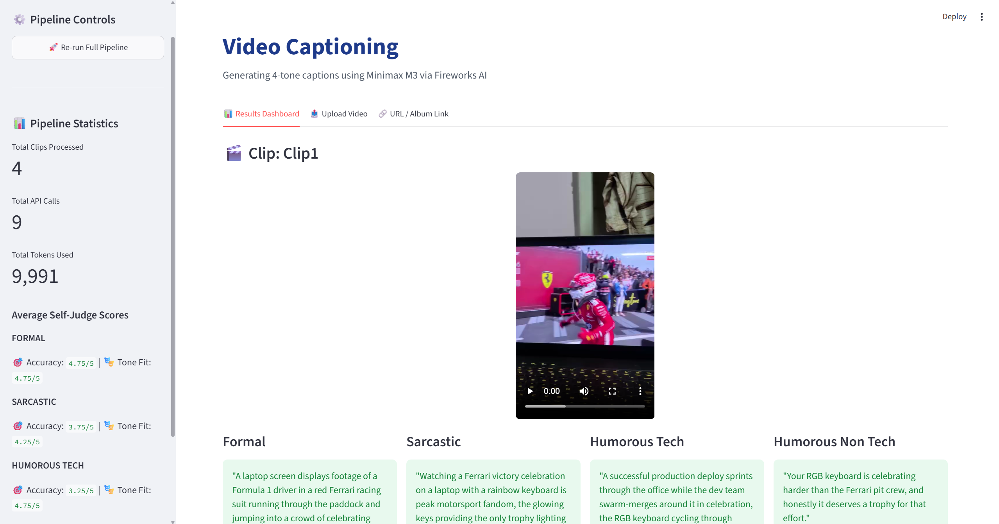

# Video Captioning Pipeline — AMD Developer Hackathon ACT II

## Overview
This project implements a modular, high-fidelity video captioning pipeline. It was originally built for the AMD Developer Hackathon ACT II Track 2, and has since been refined as a portfolio project with architectural improvements based on a postmortem analysis. 

Rather than relying on direct single-pass captioning, the system implements a decoupled architecture: it first extracts visual frames and audio transcripts to build a structured scene understanding JSON anchor, then generates four distinct tone-conditioned captions matching various narrative styles, and finally executes an LLM-based self-judge evaluation loop. This structured approach ensures factual consistency across all tones and enables automated, granular quality scoring before human or judge inspection.

## Pipeline Architecture
```
Video URL
    ↓
Stream frames directly (no download)
    ↓
1 FPS extraction + resize to 512px + green-frame filtering
    ↓
Groq Whisper transcription
    ↓
Minimax M3 structured JSON scene understanding (Fireworks AI)
    ↓
Minimax M3 structured JSON caption generation (single call, all 4 tones)
    ↓
Wall-clock budget monitor
    ↓
Results JSON + Streamlit UI
```

## Post-Hackathon Improvements
| Change | Before | After | Impact |
|---|---|---|---|
| Frame extraction | Capped 6-8 frames, local download | Direct stream, 1 FPS, no cap | More visual grounding |
| Frame resolution | Full resolution (up to 4K) | Resized to 512px width | ~5-10x token reduction per frame |
| Transcription | Local faster-whisper | Groq Whisper API (whisper-large-v3) | Removed local model dependency, faster |
| Tone prompts | Instruction-only, rigid "When you..." format | Few-shot calibration examples, natural structure | Better style-match accuracy |
| HTTP client | Synchronous requests | Async httpx with concurrency | Faster batch runtime |
| Runtime safety | Per-call timeouts only | Explicit wall-clock budget monitor | Guaranteed clean exit under limit |
| Corrupt frame handling | None | Green-frame detection and skip | Prevents hallucination on bad frames |

## Design Decisions
- **Decoupled Scene & Caption Generation**: Capturing the scene details first in a structured JSON anchor acts as a factual source of truth. All four downstream captions are forced to reference this baseline, preventing hallucinated visual discrepancies between different tone variants.
- **Minimax M3 Integration**: Choosing the state-of-the-art `minimax-m3` model via Fireworks AI provides both high-quality vision-language understanding and text generation under a single model definition. Its serverless pricing ($0.30 per million input tokens, $1.20 per million output tokens) and massive 512k context length offer production-grade performance at low operational cost.
- **LLM Self-Judge Loop**: Standardizing evaluation criteria via an autonomous self-judgment stage mirrors the automated judging parameters of the hackathon itself. Surfacing low accuracy or weak tone scores during runtime allows developers to debug prompts and track metrics incrementally.

## Tone Definitions
| Tone | Mechanism |
|---|---|
| Formal | Objective, third-person, factual — no judgment or humor |
| Sarcastic | Deadpan understatement — treats mundane as profound |
| Humorous-Tech | Scene reframed entirely through programming/tech metaphors |
| Humorous-Non-Tech | Relatable observational humor — no jargon, situational only |

## Quickstart

### Prerequisites
- Docker installed
- Fireworks AI API key (get one at [fireworks.ai](https://fireworks.ai))
- Groq API key (get one at [console.groq.com](https://console.groq.com))
- Video clips placed in `data/clips/`

### Option A — Docker (Recommended)
```bash
# 1. Clone the repo (to get the clips directory structure and results.json file)
git clone https://github.com/HarshitBilagi/Video-Captioning.git
cd Video-Captioning

# 2. Add your video clips
# Place .mp4/.mov/.avi files in data/clips/

# 3. Pull pre-built image (no build step needed)
docker pull harshitbilagi/video-captioning:latest

# 4. Run container
docker run -p 8501:8501 \
  -e FIREWORKS_API_KEY=your_key_here \
  -e GROQ_API_KEY=your_groq_key_here \
  -v $(pwd)/data/clips:/app/data/clips \
  -v $(pwd)/results.json:/app/results.json \
  harshitbilagi/video-captioning:latest

# 5. Open in browser
# http://localhost:8501
```

### Option B — Local Python
```bash
# 1. Clone and install
git clone https://github.com/HarshitBilagi/Video-Captioning.git
cd Video-Captioning
python -m venv venv
venv\Scripts\activate  # Windows
# source venv/bin/activate  # Mac/Linux
pip install -r requirements.txt

# 2. Set up environment
cp .env.example .env
# Edit .env and add your FIREWORKS_API_KEY and GROQ_API_KEY

# 3. Run pipeline then UI
python pipeline.py
streamlit run app.py
```

## Sample Output


```json
{
  "clip_id": "Clip1",
  "scene_description": {
    "setting": "A laptop screen displaying Formula 1 racing footage, filmed in a dimly lit room with a backlit RGB keyboard visible in the foreground",
    "subjects": [
      "A Ferrari Formula 1 driver in a red racing suit and helmet",
      "Ferrari team members in red uniforms",
      "A female interviewer",
      "Another Ferrari team member in red"
    ],
    "actions": [
      "The Ferrari driver runs through the paddock area",
      "The driver jumps over a barrier into a crowd of celebrating team members",
      "Team members embrace and hug the driver in celebration",
      "The driver walks through the paddock wearing a yellow cap",
      "The driver hugs another team member",
      "The driver is interviewed by a woman in front of a Pirelli backdrop"
    ],
    "notable_details": [
      "Ferrari prancing horse logo visible on red barriers",
      "Sponsor logos including HP, Shell, Lenovo, and Pirelli",
      "Ferrari flags being waved by fans",
      "The driver wears a yellow cap with 'Ferrari' branding after removing the helmet",
      "Laptop keyboard backlighting changes colors across frames (yellow, green, purple, orange, red)",
      "Crowd of fans and team members in red Ferrari attire celebrating"
    ],
    "audio_context": "No speech detected in the audio; the clip likely contains ambient crowd noise, celebration sounds, and possibly background music from the F1 broadcast, complementing the visual celebration of what appears to be a Ferrari race victory"
  },
  "captions": {
    "formal": "A laptop screen displays footage of a Formula 1 driver in a red Ferrari racing suit running through the paddock and jumping into a crowd of celebrating team members in red uniforms. In the foreground, the laptop's RGB keyboard backlighting cycles through various colors while the footage shows the driver embracing team members and later being interviewed by a woman in front of a sponsor backdrop.",
    "sarcastic": "Watching a Ferrari victory celebration on a laptop with a rainbow keyboard is peak motorsport fandom, the glowing keys providing the only trophy lighting necessary.",
    "humorous_tech": "A successful production deploy sprints through the office while the dev team swarm-merges around it in celebration, the RGB keyboard cycling through green-yellow-red status indicators as the lead engineer finally approves the pull request during the post-deploy interview.",
    "humorous_non_tech": "Your RGB keyboard is celebrating harder than the Ferrari pit crew, and honestly it deserves a trophy for that effort."
  },
  "self_judge_scores": {
    "formal": {
      "accuracy": 4,
      "tone_fit": 4
    },
    "sarcastic": {
      "accuracy": 3,
      "tone_fit": 4
    },
    "humorous_tech": {
      "accuracy": 2,
      "tone_fit": 4
    },
    "humorous_non_tech": {
      "accuracy": 3,
      "tone_fit": 5
    }
  }
}
```

## Project Structure
```
video-captioning/
├── src/
│   ├── extraction.py          # Frame extraction + Groq Whisper transcription
│   ├── scene_understanding.py # Vision → structured JSON
│   ├── caption_generation.py  # 4-tone caption generation
│   ├── self_judge.py          # LLM self-evaluation loop
│   ├── style_prompts.py       # Calibration-based style prompts and guidelines
│   └── model_client.py        # Fireworks API abstraction layer
├── app.py                     # Streamlit demo UI
├── pipeline.py                # End-to-end orchestration
├── config/models.yaml         # Model configuration (swap models here)
├── data/clips/                # Place video clips here
├── results.json               # Generated output
├── Dockerfile
├── requirements.txt
└── .env.example               # Copy to .env and add your API key
```

## Environment Variables
| Variable | Required | Description |
|---|---|---|
| FIREWORKS_API_KEY | Yes | Your Fireworks AI API key |
| GROQ_API_KEY | Yes | Your Groq API key for Whisper transcription |
| GROQ_WHISPER_MODEL | No | Whisper model to use (default: whisper-large-v3) |
| MIN_VIDEO_SECONDS | No | Minimum allowed clip duration in seconds (default: 2) |
| MAX_VIDEO_SECONDS | No | Maximum allowed clip duration in seconds (default: 300) |
| FRAMES_PER_SECOND | No | Sampling rate for video frames (default: 1.0) |
| FRAME_JPEG_QUALITY | No | Compression quality for frame encoding (default: 70) |

*Note: Never commit your real `.env` file. It is gitignored by default.*

## Tech Stack
| Component | Tool |
|---|---|
| Frame Extraction | OpenCV |
| Audio Transcription | Groq Whisper API (whisper-large-v3) |
| Vision + Caption + Judge | Minimax M3 (Fireworks AI) |
| HTTP Client | httpx |
| Demo UI | Streamlit |
| Containerization | Docker |

## Track
AMD Developer Hackathon ACT II — Track 2: Video Captioning
